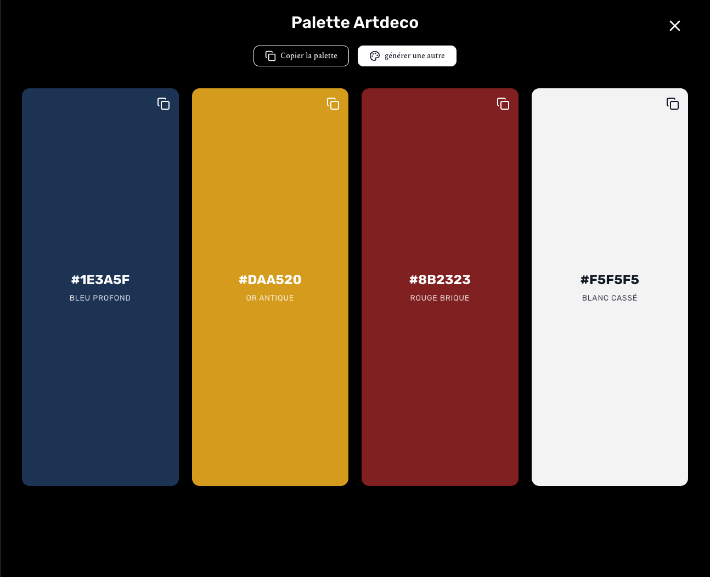

# Générateur de Palette de Couleurs pour Intérieur

---

## Description

Ce projet est un générateur de palettes de couleurs pour la décoration intérieure (maisons, espaces variés), basé sur l’intelligence artificielle. Il permet de créer des combinaisons harmonieuses et adaptées à différents styles de design d’intérieur.

L’utilisateur choisit un style (ex : moderne, scandinave, bohème, industriel...) et l’IA génère une palette cohérente avec les codes couleurs en hexadécimal et le nom des couleurs. Le résultat est affiché avec une interface claire, épurée et responsive.

---

## Technologies principales

- **Next.js 15** — Framework React pour un rendu côté serveur performant.
- **TypeScript** — Typage statique pour plus de robustesse.
- **AI & SDK @ai-sdk/gateway** — Intégration de l’intelligence artificielle pour la génération dynamique des palettes.
- **Tailwind CSS** — Pour un design moderne, rapide et responsive.
- **Vercel** — Hébergement et déploiement continu sur plateforme cloud.
- **lucide-react** — Bibliothèque d’icônes React modernes et légères.

---

## Fonctionnalités

- Sélection intuitive parmi plusieurs styles d’intérieur populaires.
- Génération automatique de palettes avec codes hexadécimaux et noms des couleurs.
- Copie facile des codes couleurs et de la palette complète.
- Interface utilisateur moderne, épurée, et adaptée aux mobiles et grands écrans.
- Gestion des états de chargement et erreurs.
- Routes Next.js sécurisées pour appels à l’API IA.

---

## Installation et démarrage local

### Prérequis

- Node.js (version 20 ou supérieure recommandée)
- npm ou yarn

### Étapes

git clone https://github.com/ton-utilisateur/ton-repo.git
cd ton-repo
npm install
npm run dev`

Ouvre ensuite [http://localhost:3000](http://localhost:3000) dans ton navigateur pour tester l’application.

---

## Structure du projet

- `/app` — Pages et routes Next.js (App Router).
- `/components` — Composants React réutilisables (palette, alertes, boutons).
- `/utils` — Fonctions utilitaires et données statiques (styles déco…).
- `/lib` — Configuration et polices (ex : Rubik via Google Fonts).
- `app/api` — Routes serveur pour génération IA (prompt, traitement JSON).

---

## Déploiement

Le projet est prévu pour être déployé sur **Vercel** :

- Assure-toi que tes clefs d’API IA sont correctement configurées dans les variables d’environnement Vercel.
- Utilise la commande standard :
  vercel --prod

ou fais un push sur ta branche principale qui déclenchera un déploiement automatique.

---

## Personnalisation

- Ajoute ou modifie les styles de déco proposés (boutons de styles) dans `/utils/buttonsDataInfo.ts`.
- Adapte le prompt AI pour ajuster les formats ou le style des palettes.
- Modifie les composants UI avec Tailwind pour changer l’apparence des cartes couleurs, boutons, etc.

---

## Contribuer

Les contributions sont les bienvenues :

- Propose des améliorations, nouvelles fonctionnalités ou corrections de bugs.
- Ouvre une issue pour discuter avant une grosse modification.
- Soumets un Pull Request avec une description claire.

---

## Licence

Ce projet est distribué sous la licence MIT.

---

## Remerciements

Merci aux équipes et communautés derrière :

- [Next.js](https://nextjs.org/)
- [Tailwind CSS](https://tailwindcss.com/)
- [Lucide React](https://lucide.dev/)
- [Vercel](https://vercel.com/)
- L’API IA intégrée

---

## Contact

Stephane Mfuni – [stiviggs217@gmail.com](mailto:stiviggs217@gmail.com)  
Projet sur GitHub : [https://github.com/silverstone217/deco-color](https://github.com/silverstone217/deco-color)

---

_Crée en 2025 avec ❤️ pour l’Intelligence Artificielle et le design intérieur._

---

# DECO-COLOR
